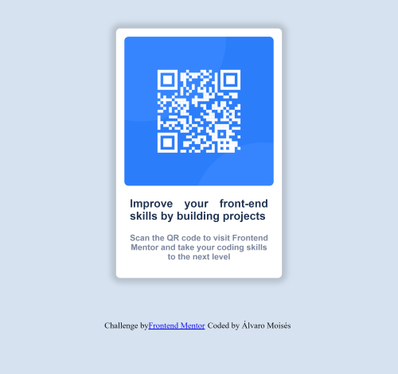

# Frontend Mentor - QR code component solution

This is a solution to the [QR code component challenge on Frontend Mentor](https://www.frontendmentor.io/challenges/qr-code-component-iux_sIO_H). Frontend Mentor challenges help you improve your coding skills by building realistic projects. 

## Table of contents

- [Overview](#overview)
  - [Screenshot](#screenshot)
  - [Links](#links)
- [My process](#my-process)
  - [Built with](#built-with)
  - [What I learned](#what-i-learned)
  - [Continued development](#continued-development)
  - [Useful resources](#useful-resources)
- [Author](#author)
-
## Overview
this is the first challenge that i complete from Frontend Mentor, Frontend Mentor is a great website with ideas to practice, so check it out if yur are interested.

the challenge was build a QR card site, with 375px and 1440px as screen sizes, it´s a entry level and the suggested tecnologies are: 

-HTML
-CSS

but you can use a lot more, for the challenge i use Pug for the HTMl layout, and SASS as CSS preprocessor.
### Screenshot

Add a screenshot of your solution. The easiest way to do this is to use Firefox to view your project, right-click the page and select "Take a Screenshot". You can choose either a full-height screenshot or a cropped one based on how long the page is. If it's very long, it might be best to crop it.

Alternatively, you can use a tool like [FireShot](https://getfireshot.com/) to take the screenshot. FireShot has a free option, so you don't need to purchase it. 

Then crop/optimize/edit your image however you like, add it to your project, and update the file path in the image above.

### Links

- Solution URL: [github repository](https://github.com/Alvaro-Moises-Gonzalez/Frontend-Mentor-QR-code-Challenge)
- Live Site URL: [Add live site URL here](https://your-live-site-url.com)

## My process

first i create a pug file to be my index file, on it i write some code to import fonts from google fonts, then i link the style sheet file in the head section on the file

i created a section with the class card being the container of the card, inside it i created a img tag with the image to display, the crated a h1 and h2 to be containers for the text, and finally create a section for the attribution part. the result was compiled into a HTML file.

fot the styling i create a sass file, on the start of the file i declared vars, for the color, fonts and sizes for the screen. then i created two mixings one for the box shadow for easy manipulation, and the other for managing the media query.

so i started codin a css reset, specifying the font size, and background colors, and starting to stylize the card. and so i was using sass, i take advantages of its nestling capabilities, and invoking the media query mixin on it to specify styles on the large screen size.

i start to mobile fist, so i only have to specify a mediaquery for the large screen size.

### Built with

- Semantic HTML5 and Pug as HTML preprocessor
- CSS and SASS as CSS preprocessor
- Flexbox
- Mobile-first workflow

### What I learned

I have a bad time beacuse HTML compiled from pug doesnt recognize the routes for the images and the favi ico, so i have to tweak some code in the compiled file. i reinforce my knowledge of preprocessor but i have to practice more to dominate it, i like how one can implement media queries in sass, but still im not satisfyed i think i can improve in that topic.

### Continued development

i´m going to practice a lot more on media queries searching for a more organized code, that be easier to read and mantain.

## Author
- Frontend Mentor - [@yourusername](https://www.frontendmentor.io/profile/Alvaro-Moises-Gonzalez)

